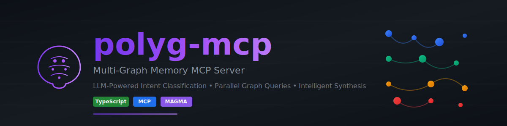
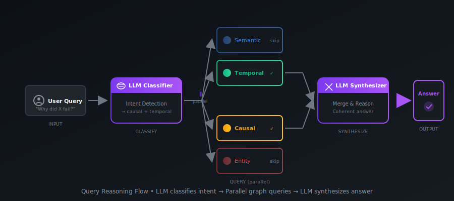

<p align="center">
  
</p>

<p align="center">
  <a href="#-quick-start"></a>
  <a href="https://github.com/yourname/polyg-mcp/stargazers"></a>
  <a href="LICENSE"></a>
  <a href="https://www.typescriptlang.org/"></a>
</p>

<p align="center">
  <b>Stop asking your agent to keyword-search a single graph.</b><br/>
  Let it <i>understand intent</i>, <i>query multiple memories in parallel</i>, and <i>reason like a human</i>.
</p>

<p align="center">
  <a href="#-features">Features</a> •
  <a href="#-the-four-memory-graphs">Architecture</a> •
  <a href="#-quick-start">Quick Start</a> •
  <a href="#-mcp-tools">API</a> •
  <a href="#-why-polyg-mcp">Why polyg?</a>
</p>

---

## ✨ Features

<table>
<tr>
<td width="50%">

### 🧠 LLM Intent Classification
Automatically understands *what* the user is asking — whether it's about concepts, events, causes, or entities.

### ⚡ Parallel Graph Queries  
Queries only the relevant memory graphs simultaneously, not sequentially through a single store.

</td>
<td width="50%">

### 🔗 Multi-Graph Synthesis
Combines results from multiple knowledge dimensions into a single, coherent, reasoned answer.

### 🔌 MCP Native
Built for the Model Context Protocol — works with Claude, Cursor, LangGraph, and any MCP-compatible agent.

</td>
</tr>
</table>

---

## 🧩 Why polyg-mcp?

### The Problem

Most MCP memory servers work like this:

```
User Query → Keyword Search → Single Graph → Raw Results
```

<table>
<tr><td>❌</td><td>No understanding of <i>intent</i></td></tr>
<tr><td>❌</td><td>No temporal or causal reasoning</td></tr>
<tr><td>❌</td><td>No synthesis across dimensions</td></tr>
</table>

### The polyg-mcp Solution

<p align="center">
  
</p>

---

## 🧠 The Four Memory Graphs

<p align="center">
  
</p>

| Graph | Purpose | Example Query |
|:------|:--------|:--------------|
| **🔵 Semantic** | Concepts, similarity, embeddings | *"What do we know about authentication?"* |
| **🟢 Temporal** | Events, timestamps, sequences | *"What happened last Tuesday?"* |
| **🟠 Causal** | Cause → effect relationships | *"Why did the deployment fail?"* |
| **🔴 Entity** | Persistent objects, ownership | *"Who owns the payment service?"* |

---

## 🚀 Quick Start

### Using Docker (Recommended)

```bash
git clone https://github.com/yourname/polyg-mcp.git
cd polyg-mcp

# Configure environment
cp .env.example .env

# Start the server
docker-compose up -d
```

### From Source

```bash
# Clone and install
git clone https://github.com/yourname/polyg-mcp.git
cd polyg-mcp
npm install

# Configure and run
cp .env.example .env
npm run dev
```

### Connect to Claude Desktop

Add to your `claude_desktop_config.json`:

```json
{
  "mcpServers": {
    "polyg": {
      "command": "npx",
      "args": ["polyg-mcp"],
      "env": {
        "OPENAI_API_KEY": "your-key-here"
      }
    }
  }
}
```

---

## 🔌 MCP Tools

### MAGMA Retrieval Tools (6 tools)

| Tool | Purpose |
|------|---------|
| `semantic_search` | Find seed concepts via vector similarity |
| `entity_lookup` | Expand entity relationships from seeds |
| `temporal_expand` | Query events involving seed entities |
| `causal_expand` | Traverse causal chains from seed entities |
| `subgraph_merge` | Combine and score graph views |
| `linearize_context` | Format merged subgraph for LLM |

### Write Tools (7 tools)

| Tool | Purpose |
|------|---------|
| `remember` | Store natural language memory |
| `add_entity` | Add entity to graph |
| `add_event` | Add temporal event |
| `add_fact` | Add time-bounded fact |
| `add_concept` | Add semantic concept |
| `add_causal_link` | Create cause → effect link |
| `link_entities` | Create entity relationship |

### Admin Tools (2 tools)

| Tool | Purpose |
|------|---------|
| `get_statistics` | Get graph statistics |
| `clear_graph` | Clear specific graph |

---

## 🎯 Live Example

**Query:**
```
Why did the auth service fail after the Tuesday deployment?
```

**MAGMA Pipeline:**

1. **Intent Classification** → Detects: `WHY` intent with depth hints (causal=3, temporal=1)
2. **Semantic Search** → Finds seed concepts matching "auth service", "deployment", "failure"
3. **Seed Extraction** → Uses X_REPRESENTS links to find entity IDs
4. **Parallel Expansion** → Causal chains (depth 3) + Temporal events (depth 1)
5. **Subgraph Merge** → Combine views, boost nodes found in multiple graphs
6. **Linearization** → Order nodes for causal reasoning (cause → effect)
7. **Synthesis** → LLM generates answer from structured context

**Answer:**
> "The auth service failed because the AUTH_SECRET environment variable was missing in the Tuesday deployment. The config was refactored on Monday, and the new deployment template didn't include the secret."

---

## ⚡ Performance

| Metric | Value |
|:-------|:------|
| MAGMA pipeline steps | 7 (classify → search → seed → expand → merge → linearize → synthesize) |
| Parallel graph expansion | ✅ Entity, Temporal, Causal expanded simultaneously |
| LLM calls per query | 2 (intent classify + synthesize) |
| Intent-based depth | Adaptive (WHY=deep causal, WHEN=deep temporal, etc.) |

---

## 🛠 Configuration

```bash
# .env
OPENAI_API_KEY=sk-...          # Required for LLM calls
EMBEDDING_MODEL=text-embedding-3-small
LLM_MODEL=gpt-4o-mini

# Optional
POLYG_PORT=3000
POLYG_LOG_LEVEL=info
```

---

## 📦 Roadmap

- [x] Core multi-graph architecture (Entity, Temporal, Causal, Semantic)
- [x] MAGMA retrieval pipeline (intent → seed → expand → merge → linearize)
- [x] LLM intent classification (WHY/WHEN/WHO/WHAT/EXPLORE)
- [x] Cross-graph linking (X_REPRESENTS, X_INVOLVES)
- [x] MCP tool interface (15 tools: 6 MAGMA + 7 write + 2 admin)
- [x] FalkorDB persistent storage
- [ ] Semantic indexing in write tools (auto X_REPRESENTS creation)
- [ ] Graph visualization UI
- [ ] Streaming responses

---

## 🤝 Contributing

Contributions are welcome! Please read our [Contributing Guide](CONTRIBUTING.md) first.

```bash
# Run tests
npm test

# Run linting
npm run lint

# Build
npm run build
```

---

## 📄 License

[MIT](LICENSE) © 2025

---

<p align="center">
  <b>If this resonates with you, consider giving it a ⭐</b><br/>
  <sub>Built with 🧠 for agents that need to <i>actually remember</i></sub>
</p>

<p align="center">
  <a href="https://github.com/yourname/polyg-mcp/issues">Report Bug</a> •
  <a href="https://github.com/yourname/polyg-mcp/issues">Request Feature</a> •
  <a href="https://discord.gg/yourserver">Discord</a>
</p>
