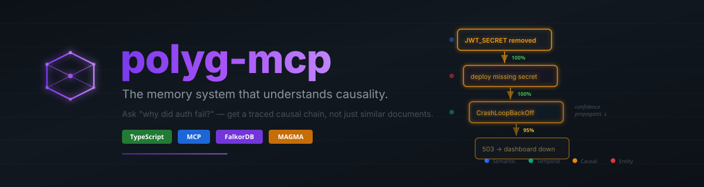
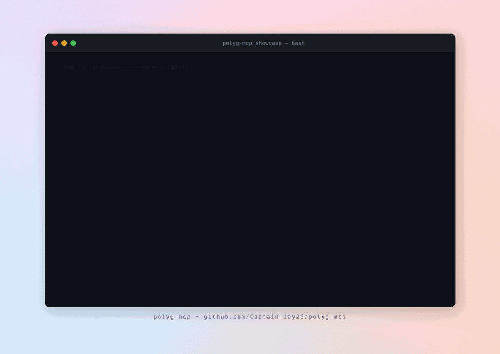
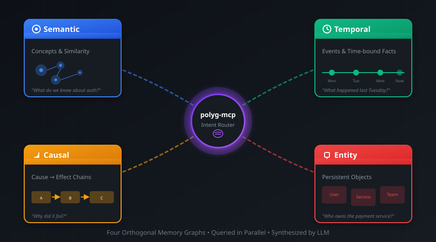
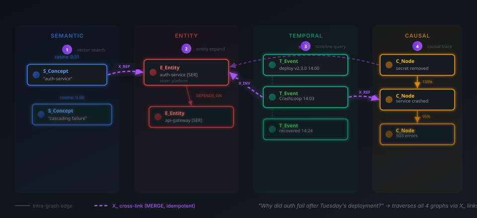
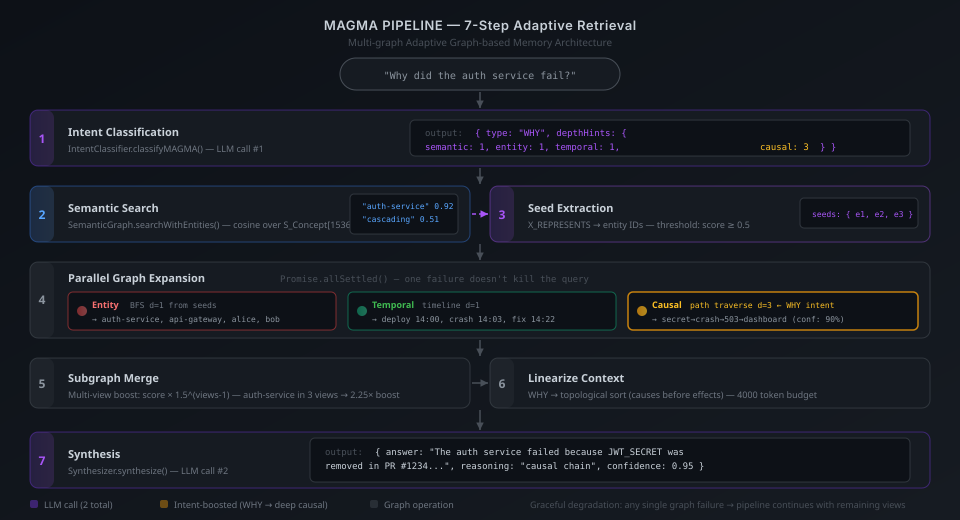

<p align="center">
  
</p>

<p align="center">
  <a href="https://www.npmjs.com/package/polyg-mcp"></a>
  <a href="#quick-start"></a>
  <a href="https://github.com/Captain-Jay29/polyg-mcp/stargazers"></a>
  <a href="LICENSE"></a>
  <a href="https://www.typescriptlang.org/"></a>
</p>

<p align="center">
  <b>The memory system that understands causality.</b><br/>
  <sub>Ask "why did auth fail?" and get a traced causal chain — not just similar documents.</sub>
</p>

<p align="center">
  
</p>

<p align="center">
  <a href="#the-problem">Problem</a> &middot;
  <a href="#architecture">Architecture</a> &middot;
  <a href="#magma-pipeline">Pipeline</a> &middot;
  <a href="#quick-start">Quick Start</a> &middot;
  <a href="docs/arch.md">Deep Dive</a>
</p>

---

## The Problem

Most agent memory is flat retrieval — cosine similarity over text chunks. polyg-mcp is a multi-graph memory system that traces cause-effect chains, reconstructs timelines, maps entity dependencies, and answers "why" with confidence-scored causal paths.

```
Query: "Why did the auth service fail?"

Vector store → 5 documents mentioning "auth service" ranked by cosine similarity.

polyg-mcp  → JWT_SECRET removed (PR #1234) → deploy missing secret → CrashLoopBackOff → 503s
                    ↓ 100%                        ↓ 100%                  ↓ 95%           ↓ 90%

             Root cause identified with full causal chain.
             Confidence degrades at each hop — quantified uncertainty, not guesswork.
```

Four purpose-built graphs (semantic, entity, temporal, causal) connected by typed cross-links (`X_REPRESENTS`, `X_INVOLVES`, `X_AFFECTS`, `X_REFERS_TO`) enable a single query to traverse all four dimensions. The system exposes 15 MCP tools and requires 2 LLM calls per retrieval — one for intent classification, one for synthesis.

---

## Architecture

### System Overview

```
MCP Client (Claude, Cursor, any MCP agent)
     │
     │  MCP Protocol (HTTP/SSE)
     ▼
PolygMCPServer ─── Tool Registration (15 tools: 6 MAGMA + 7 write + 2 admin)
     │
     ▼
SharedResources ── Orchestrator, FalkorDB Adapter, LLM Provider, Embedding Provider
     │
     ▼
MAGMA Pipeline ── IntentClassifier → Executor → Merger → Linearizer → Synthesizer
     │
     ├── SemanticGraph   (S_Concept, vector similarity, cosine distance)
     ├── EntityGraph      (E_Entity, E_RELATES, BFS traversal)
     ├── TemporalGraph    (T_Event, T_Fact, ISO timestamp sort)
     ├── CausalGraph      (C_Node, C_CAUSES with confidence, path traversal)
     └── CrossLinker       (X_REPRESENTS, X_INVOLVES, X_AFFECTS, X_REFERS_TO)
            │
            ▼
       FalkorDB (Redis-based graph database, Cypher queries)
```

### Four Memory Graphs

<p align="center">
  
</p>

| Graph | Node Type | Schema | Edge Type | Query Algorithm |
|:------|:----------|:-------|:----------|:----------------|
| **Semantic** | `S_Concept` | `uuid`, `name`, `embedding[1536]` | Cosine similarity | Vector distance, O(n*d) |
| **Entity** | `E_Entity` | `uuid`, `name`, `type`, `properties{}` | `E_RELATES` (typed, directional) | BFS traversal, O(V+E) |
| **Temporal** | `T_Event` / `T_Fact` | `uuid`, `description`, `occurred_at` / `valid_from`, `valid_to` | Chronological ordering | ISO timestamp sort, O(n log n) |
| **Causal** | `C_Node` | `uuid`, `description`, `node_type` | `C_CAUSES` (confidence: 0.0-1.0) | Directed path traversal, O(V+E) |

### Cross-Graph Linking

The graphs are not isolated. Typed `X_` edges connect nodes across graph boundaries, enabling multi-hop traversal from a single query:

<p align="center">
  
</p>

| Cross-Link | Direction | Purpose | Created by |
|:-----------|:----------|:--------|:-----------|
| `X_REPRESENTS` | S_Concept → E_Entity | Grounds a concept to its real-world entity | `CrossLinker` on write |
| `X_INVOLVES` | T_Event → E_Entity | Links an event to participating entities | `CrossLinker` on write |
| `X_AFFECTS` | C_Node → E_Entity | Connects a causal node to impacted entities | `CrossLinker` on write |
| `X_REFERS_TO` | T_Event → C_Node | Links an event to the causal node it triggered | `CrossLinker` on write |

All cross-links use `MERGE` for idempotency. When a graph is cleared, orphaned `X_` links are automatically cleaned.

**Traversal example** — *"Why did auth fail after Tuesday's deployment?"*:

```
Semantic search      → S_Concept("auth-service", score=0.92)
    ↓ X_REPRESENTS
Entity expand        → E_Entity("auth-service", type=SERVICE) → E_RELATES → E_Entity("api-gateway")
    ↓ X_INVOLVES
Temporal expand      → T_Event("deploy v2.3.0", 14:00) → T_Event("CrashLoop", 14:03)
    ↓ X_REFERS_TO
Causal expand        → C_Node("secret removed") →[100%]→ C_Node("crash") →[95%]→ C_Node("503s")
```

---

## MAGMA Pipeline

**MAGMA** (Multi-graph Adaptive Graph-based Memory Architecture) processes every retrieval in 7 steps with 2 LLM calls:

<p align="center">
  
</p>

| Step | Component | Operation | Output |
|:-----|:----------|:----------|:-------|
| 1 | `IntentClassifier` | LLM extracts intent + per-graph depth hints | `{ type: "WHY", depthHints: { causal: 3, ... } }` |
| 2 | `SemanticGraph.searchWithEntities()` | Cosine similarity over `S_Concept` embeddings | Ranked concepts with `linkedEntityIds` |
| 3 | `MAGMAExecutor.extractSeedsFromEnriched()` | Follow `X_REPRESENTS` edges, filter by score >= 0.5 | `Set<entityId>` |
| 4 | `MAGMAExecutor.expandFromSeeds()` | Parallel via `Promise.allSettled` — partial failure safe | Entity, temporal, causal views |
| 5 | `SubgraphMerger.merge()` | Hash aggregation + multi-view boost | `MergedSubgraph { nodes[], edges[] }` |
| 6 | `ContextLinearizer.linearize()` | Intent-specific sort, enforce 4000-token budget | Ordered context string |
| 7 | `Synthesizer.synthesize()` | LLM generates answer from structured context | `{ answer, reasoning, confidence }` |

### Intent-Adaptive Depth

The classifier allocates traversal depth per graph. This is the core of adaptive retrieval — the system doesn't expand uniformly.

```
             Semantic  Entity  Temporal  Causal
  WHY            1       1        1        3      ← deep causal chain traversal
  WHEN           1       1        3        1      ← deep timeline reconstruction
  WHO / WHAT     1       2        1        1      ← entity relationship expansion
  EXPLORE        2       2        2        2      ← uniform exploration
```

### Linearization Strategies

After merging, nodes must be ordered for the LLM context window. The sort strategy is intent-dependent:

| Intent | Strategy | Effect |
|:-------|:---------|:-------|
| `WHY` | Topological sort | Causes appear before effects — LLM reads the chain in logical order |
| `WHEN` | Chronological sort | Events ordered by `occurred_at` — natural timeline |
| `WHO` / `WHAT` | Relevance-weighted | Most-connected entities surface first |
| `EXPLORE` | Frequency-based | Most-referenced nodes first |

### Multi-View Boosting

Nodes found in multiple graph expansions receive a relevance boost. The intuition: if a node appears in both causal and temporal views, it's more likely to be central to the answer.

```
final_score = avg_score × 1.5^(view_count - 1)

  1 view  → 1.0×     (single graph only)
  2 views → 1.5×     (corroborated)
  3 views → 2.25×    (strong cross-graph signal)
  4 views → 3.375×   (central to entire context)
```

---

## Quick Start

### Install

```bash
npm install -g polyg-mcp
# or run directly
npx polyg-mcp
```

### Prerequisites

FalkorDB (graph database):

```bash
docker run -d -p 6379:6379 falkordb/falkordb
```

### Claude Desktop

Add to `claude_desktop_config.json`:

```json
{
  "mcpServers": {
    "polyg": {
      "command": "npx",
      "args": ["polyg-mcp"],
      "env": {
        "OPENAI_API_KEY": "your-key-here",
        "FALKORDB_HOST": "localhost",
        "FALKORDB_PORT": "6379"
      }
    }
  }
}
```

### Docker Compose

```bash
git clone https://github.com/Captain-Jay29/polyg-mcp.git
cd polyg-mcp
cp .env.example .env
docker-compose up -d
```

### From Source

```bash
git clone https://github.com/Captain-Jay29/polyg-mcp.git
cd polyg-mcp && npm install
cp .env.example .env
npm run dev
```

---

## MCP Tools

15 tools exposed via MCP. Compatible with Claude, Cursor, and any MCP agent.

<details>
<summary><b>MAGMA Retrieval (6 tools)</b></summary>

| Tool | Operation |
|:-----|:---------|
| `semantic_search` | Cosine similarity over `S_Concept` embeddings, returns enriched matches with `linkedEntityIds` |
| `entity_lookup` | BFS expansion from seed entity IDs, configurable depth, returns `E_Entity` nodes + `E_RELATES` edges |
| `temporal_expand` | Time-range query over `T_Event` / `T_Fact`, returns chronologically ordered events |
| `causal_expand` | Directed path traversal over `C_Node` → `C_CAUSES`, returns chains with per-edge confidence |
| `subgraph_merge` | Combines entity/temporal/causal views, applies multi-view boosting formula |
| `linearize_context` | Formats merged subgraph into token-budgeted string using intent-specific sort strategy |

</details>

<details>
<summary><b>Write (7 tools)</b></summary>

| Tool | Operation |
|:-----|:---------|
| `remember` | Natural language memory storage (auto-routes to appropriate graph) |
| `add_entity` | Create `E_Entity` node with `type` and `properties` map |
| `add_event` | Create `T_Event` node with ISO `occurred_at` timestamp |
| `add_fact` | Create `T_Fact` node with `subject`, `predicate`, `valid_from` / `valid_to` |
| `add_concept` | Create `S_Concept` with auto-generated `text-embedding-3-small` embedding |
| `add_causal_link` | Create two `C_Node` nodes connected by `C_CAUSES` edge with confidence (self-loop prevention) |
| `link_entities` | Create typed `E_RELATES` edge between two `E_Entity` nodes (self-loop prevention) |

</details>

<details>
<summary><b>Admin (2 tools)</b></summary>

| Tool | Operation |
|:-----|:---------|
| `get_statistics` | Node/edge counts per graph + cross-link statistics |
| `clear_graph` | Selective graph clear with automatic orphaned `X_` link cleanup |

</details>

---

## Configuration

```bash
# .env
OPENAI_API_KEY=sk-...               # Required — LLM + embeddings
EMBEDDING_MODEL=text-embedding-3-small
LLM_MODEL=gpt-4o-mini
CLASSIFIER_MAX_TOKENS=1000           # Intent classifier token limit
SYNTHESIZER_MAX_TOKENS=2000          # Synthesizer output limit

FALKORDB_HOST=localhost
FALKORDB_PORT=6379
FALKORDB_QUERY_TIMEOUT=30000         # Max query execution (ms)

POLYG_PORT=3000
POLYG_LOG_LEVEL=info
POLYG_PARALLEL_TIMEOUT=30000         # Graph expansion timeout (ms)
POLYG_MAX_RETRIES=3                  # LLM retry with exponential backoff
```

---

## Project Structure

```
polyg-mcp/
├── packages/
│   ├── core/src/
│   │   ├── graphs/
│   │   │   ├── semantic.ts         # Vector similarity (cosine over 1536-dim)
│   │   │   ├── entity.ts           # Entity relationships (BFS)
│   │   │   ├── temporal.ts         # Timeline queries (ISO sort)
│   │   │   ├── causal.ts           # Cause-effect chains (path traversal)
│   │   │   └── cross-linker.ts     # X_* relationship management
│   │   ├── executor/
│   │   │   └── magma-executor.ts   # MAGMA pipeline orchestration
│   │   ├── retrieval/
│   │   │   ├── subgraph-merger.ts  # Multi-view boosting
│   │   │   ├── context-linearizer.ts
│   │   │   └── seed-extraction.ts
│   │   ├── agents/
│   │   │   ├── intent-classifier.ts
│   │   │   └── synthesizer.ts
│   │   └── storage/
│   │       └── falkordb-adapter.ts # Cypher query builder
│   ├── server/src/
│   │   ├── mcp-server-factory.ts   # 15 tool registrations
│   │   └── shared-resources.ts     # Dependency injection
│   └── shared/src/
│       ├── types.ts                # TypeScript interfaces
│       └── schemas.ts              # Zod validation
├── docker-compose.yml
└── tests/
```

---

## Contributing

See [CONTRIBUTING.md](CONTRIBUTING.md).

```bash
pnpm test
pnpm lint
pnpm build
```

## License

[MIT](LICENSE)

---

<p align="center">
  <sub>Built for agents that need to answer <i>"why"</i> — not just <i>"what"</i>.</sub>
</p>

<p align="center">
  <a href="https://github.com/Captain-Jay29/polyg-mcp/issues">Report Bug</a> &middot;
  <a href="https://github.com/Captain-Jay29/polyg-mcp/issues">Request Feature</a>
</p>
